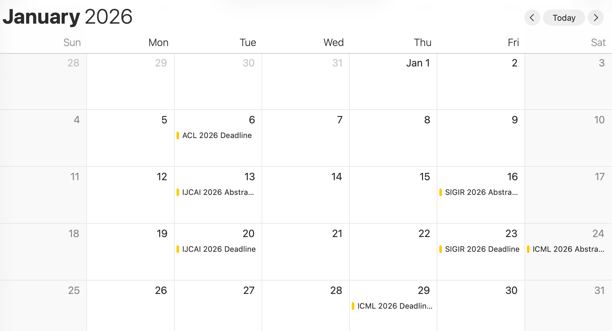
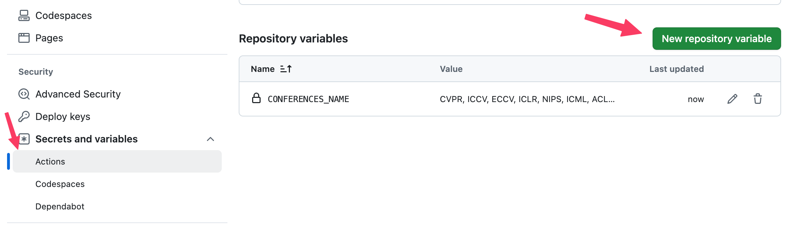

# AI Conf Calendar

A personalized, automated AI conference calendar service powered by [ccfddl](https://github.com/ccfddl/ccf-deadlines) data. Track your favorite conferences with a custom calendar subscription, updated daily via GitHub Actions.

## Demo

Try my generated calendar:
[Demo Calendar Link](https://ronpay.github.io/ai-conf-calendar/deadlines_diy_en.ics)

Refer to the "Subscribe to Calendar" for subscription details.

## Usage

### Subscribe to Calendar
Simply copy the `.ics` URL and subscribe in your preferred calendar application (Apple Calendar, Google Calendar, etc.).

**Apple Calendar Example (Verified):**
1. Open **Add Calendars** > **New Calendar Subscription**
2. Paste your calendar URL.
3. Enjoy automatic updates.

## Personalized Configuration

1. **Fork this repository** to your own GitHub account.
2. Go to **Settings** > **Secrets and variables** > **Actions** > **Variables**.
3. Add a new repository variable named `CONFERENCES_NAME`.
   - **Value:** A list of conference names separated by commas and spaces (e.g., `CVPR, ICCV, ECCV`).
4. **Trigger the Action:**
   - Go to the **Actions** tab, select "Generate Conference Calendar", and click **Run workflow**.
   - Alternatively, wait for the daily automatic schedule.
5. **Enable GitHub Pages:**
   - Go to **Settings** > **Pages**.
   - Under **Build and deployment** > **Branch**, select `release` branch and click **Save**.
6. **Get your Calendar URL:**
   - Once the action completes, a `release` branch will be created/updated.
   - Your calendar URL will be: `https://<your-username>.github.io/ai-conf-calendar/deadlines_diy_en.ics`

## Acknowledgements

Special thanks to [ccfddl](https://github.com/ccfddl/ccf-deadlines) for the underlying data support.
